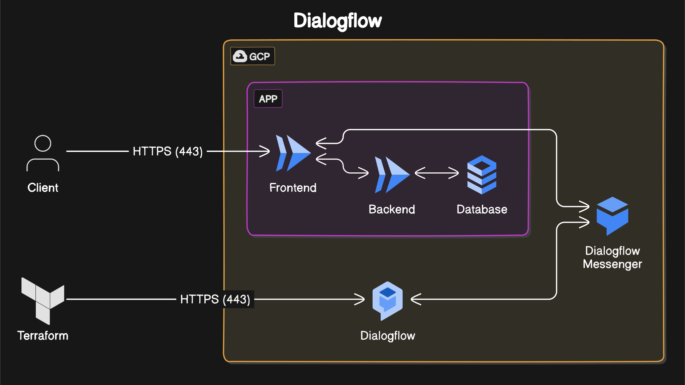

# Travel Chatbot Development using DialogFlow

## POC objectives

Validate the use of a travel chatbot in the context of facilitating travel bookings (flights, hotels,...) and providing trip assistance.

## Infra architecture

- **Logical Components**: Dialogflow, Webhooks (for backend integration), Database (for storing travel data), Cloud Hosting (Google Cloud Platform).
- **Ports/Protocols**: HTTPS for communication between Dialogflow and backend systems.
- **Cloud Type**: Public Cloud (Google Cloud Platform) for hosting Dialogflow and other services.
- **Deployment**: Terraform scripts for creating and managing the Dialogflow agent.


## Scenario

Describe step-by-step the scenario. Write it using this format (BDD style).

Note: Only the first step is implemented in this POC.

### STEP 01

```
//given -> A user initiates a conversation with the travel chatbot.

//when -> The user expresses interest in booking a flight to a specific destination.

//then -> The chatbot prompts the user to provide details such as departure city, destination, travel dates, places to visits, and preferred airline.

```

### STEP 02

```
//given -> The user provides the required travel details.

//when -> The chatbot processes the information and checks for available flights matching the user's criteria.

//then -> The chatbot presents the user with a list of available flight options, including prices, departure times, and airlines.

```

### STEP 03

```
//given -> The user selects a flight from the options provided.

//when -> The user confirms the selection and expresses interest in booking accommodation at the destination.

//then -> The chatbot offers assistance in finding and booking hotels or other accommodations based on the user's preferences.

```

### STEP 04

```
//given -> The user provides preferences for accommodation, such as location, budget, and amenities.

//when -> The chatbot searches for available accommodations matching the user's preferences.

//then -> The chatbot presents the user with a list of hotel options, including prices, ratings, and amenities, and assists in making reservations.

```

### STEP 05

```
//given -> The user has booked a flight and accommodation.

//when -> The user asks for recommendations on activities or attractions at the destination.

//then -> The chatbot provides recommendations based on the user's interests and preferences, including popular attractions, restaurants, and events.
```

## Cost

Analysis of load-related costs:
- Dialogflow usage based on the number of interactions and requests processed.
- Compute costs for hosting the backend system and database.
- API costs for integrating with third-party services such as flight and hotel booking platforms.

Options to reduce or adapt costs:
- Implementing caching mechanisms to reduce Dialogflow queries and backend computations.
- Optimizing database queries for efficiency and reducing resource usage.
- Utilizing serverless functions for backend operations to minimize compute costs.

## Diagram



## Return of experience

This POC will assist our customers in streamlining their travel booking processes, providing personalized recommendations, and ultimately enhancing their overall travel experience.
