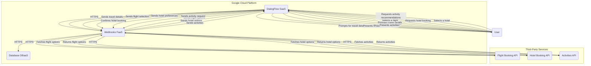

```mermaid

graph TD
subgraph Google Cloud Platform
DF(DialogFlow SaaS) --> |HTTPS| WH(Webhooks FaaS)
WH -->|HTTPS| DB(Database DBaaS)
end

    subgraph Third-Party Services
        WH -->|HTTPS| FA(Flight Booking API)
        WH -->|HTTPS| HA(Hotel Booking API)
        WH -->|HTTPS| AA(Activities API)
    end

    User(User) -->|Initiates conversation| DF
    DF -->|Prompts for travel details| User
    User -->|Provides travel details| DF
    DF -->|Sends travel details | WH
    WH -->|Fetches flight options | FA
    FA -->|Returns flight options| WH
    WH -->|Sends flight options | DF
    DF -->|Presents flight options| User
    User -->|Selects a flight| DF
    DF -->|Sends flight selection | WH
    User -->|Requests hotel booking| DF
    DF -->|Sends hotel preferences | WH
    WH -->|Fetches hotel options | HA
    HA -->|Returns hotel options| WH
    WH -->|Sends hotel options | DF
    DF -->|Presents hotel options| User
    User -->|Selects a hotel| DF
    DF -->|Confirms hotel booking | WH
    User -->|Requests activity recommendations| DF
    DF -->|Sends activity request | WH
    WH -->|Fetches activities | AA
    AA -->|Returns activities| WH
    WH -->|Sends activities | DF
    DF -->|Presents activities| User
```
